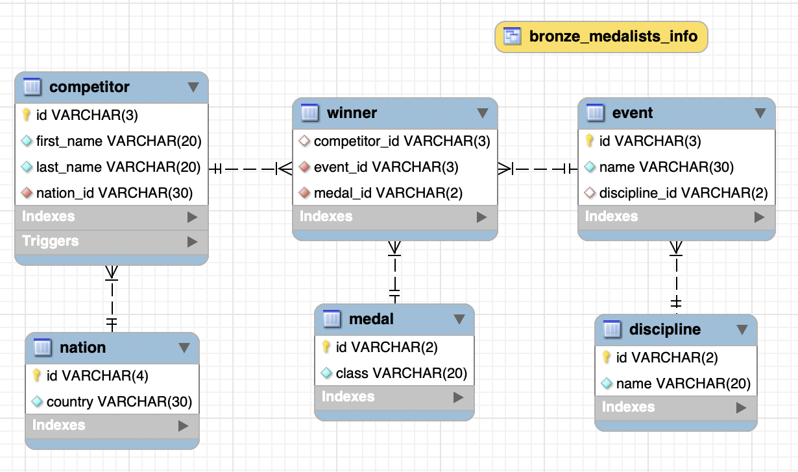

## Course project: Cycling at the 2020 Summer Olympics  

#### Introduction to Data & SQL course at [Code First Girls](https://codefirstgirls.com/courses/classes/coding-kickstarter/)  

The project reflects all major learning outcomes from the course modules.

Projects theme: Cycling at the 2020 Summer Olympics  
I decided to create a database about cycling competitions of the 2020 Summer Olympics in Tokyo.

Data source: wikipedia article [Cycling at the 2020 Summer Olympics](https://en.m.wikipedia.org/wiki/Cycling_at_the_2020_Summer_Olympics)

Data Limitations: The competition featured 22 events in five disciplines, but in my project there are just 4 disciplines and 10 events.  
A competitors list and a list of nations have all winners plus some extra names. 
So the data is real, but not full.

##### 1. Database creation
[SQL code](./databasecreation.sql)  
In MySQL Workbench I have created a relational DB of 6 tables, set Primary and Foreign Key constraints to create relations between the tables.  

##### 2. View
[SQL code](./view.sql)  
Using JOIN I have created a VIEW named '*bronze_medalists_info*'.
The VIEW combines all 6 tables and returns full information about winners, who got bronze.
In the code section there is also an example query that uses a view and returns information about *female* bronze medalists.

##### 3. Stored Function
[SQL code](./storedfunction.sql)  
The function '*which_place*' depending on the class of received medal gives each competitor a result:  
'1st place' for gold,  
'2nd place' for silver,  
'3rd place' for bronze.  
In the code section there is also an example query, that illustrates how stored function 'which_place' works and returns information about winners, who took 3rd place.

##### 4. Stored Procedure
[SQL code](./storedprocedure.sql)  
The stored procedure '*add_competitor* adds a new competitor to competitor table.  
In the code section there are also illustration how this procedure works.

##### 5. Trigger
[SQL code](./trigger.sql)  
The trigger '*competitor_name_before_insert*" enforces font consistency for inserted competitors first- and last- names.  
In the code section there are also illustration how this trigger works.

