## Case Study: Cyclistic bike-share analysis   

### Course: Google Data Analytics Capstone: Complete a Case Study at [Coursera](https://www.coursera.org/learn/google-data-analytics-capstone)

### Scenario
In this case study I am a junior data analyst working in the marketing analyst team at Cyclistic, a bike-share company in Chicago. The director
of marketing believes the company’s future success depends on maximizing the number of annual memberships. Therefore,
the team wants to understand how casual riders and annual members use Cyclistic bikes differently. From these insights,
the team will design a new marketing strategy to convert casual riders into annual members.  

### Business Question
As a jr. data analyst I was assigned you to answer the question:  
**How do annual members and casual riders use Cyclistic bikes differently?**

### Prepate Data  
[SQL Prepare Code](./01_prepare_data.sql)      
I downloaden 12 most recent datasets (july 2022 - june 2023) from a Cyclistic’s historical trip data (provided by the course in .csv format).  
Confirmed that all files have the same structure.
In MySQL Workbench I created a database *cyclistic*, a table *trips* and
loaded 12 .csv files in order to combine all datasets into one file.  

Combined dataset has 13 columns:  
*ride_id, rideable_type, started_at, ended_at, start_station_name, start_station_id, end_station_name, end_station_id, start_lat, start_lng, end_lat, end_lng, member_casual*  
and *5 779 444* rows in total

### Process Data 
[SQL Process Code](./02_process_data.sql)  
In this step I continued to explore the data:   
- Checked if there are any duplicates  
  I used two different ways to check duplicates and both of them showed there are no duplicates in the data (details in the SQL Process Code section)   
- Counted total rows, total rows with missing values, their difference and percentage  
  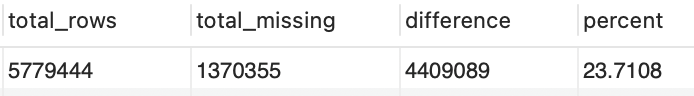  
  More than 23% of rows have missing values, lets find out which columns have missing values  
- Counted total missing values per column  
  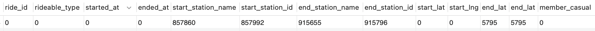   
  Missing values have 6 columns: *start_station_name, start_station_id, end_station_name, end_station_id, end_lat, end_lat*.  
  All of them are related to the location, that won't have any impact on my analysis.  
- Checked if all dates are in the correct range of time  
  There is no data outside the selected range of time.  
- Counted how many trips are shorter than 1 minute  
  There are *149 372* trips shorter than 1 minute  
- ... and longer than 48 hours (weekend)  
  There are *1 194* trips longer than 48 hours  
  
Next, I created a view *vw_trips* with extra columns: *ride_length_min*, *day_of_week* and *month*.  
Also I excluded from this view all trips with duration less than 1 minute or more than 48 hours, but 
I left the rows with missing values in 'location columns' in this view, because I still can use this data for location-not-related analysis.  
So created View represents clean data, that is ready for further analysis.

### Analyze Data
[SQL Analyze Code](./03_analyze_data.sql)  
In my analysis I have got next results:
- Count how many trips were made by annual and casual members in one year period  
  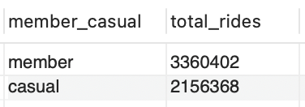  
  As we can see most customers are annual members, but still there is a lot of casual members.
- Customers bike preferences  
  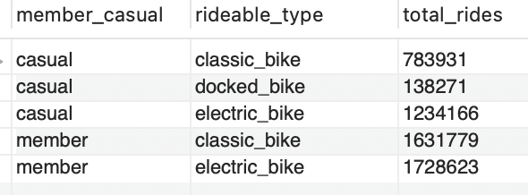  
  Annual members ride classic or electric bikes, while casual members are the only riders of docked bikes,
  also they prefer electic bikes to classic.  
- Average ride length in minutes  
    
  The average ride length of casual members is twice as long as annual members.  
- Average ride length in minutes per type of bike  
  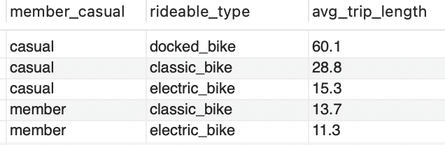  
  The longest average trip length has docked type of bike, followed by classic bike. Both are ridden by casual members. 
- Number of trips depending on weekday *(image can be zoomed by clicking on it)*  
  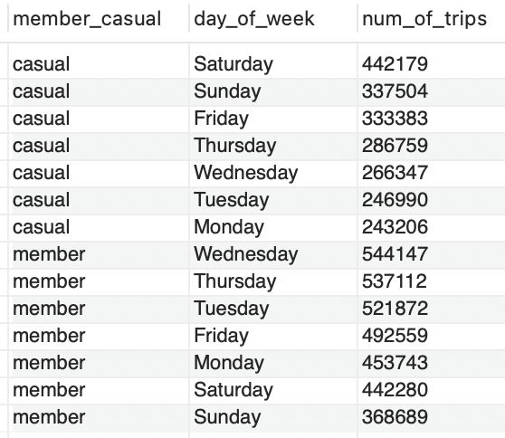  
  Casual members prefer to take a ride in weekends, while annual members - on weekdays  
- Average trip length per weekday *(image can be zoomed by clicking on it)*   
  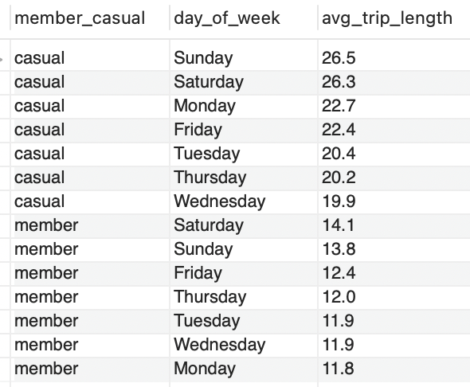  
  Both annual and casual members show the tendency to have longer trips in weekends.  
- Number of trips depending on month *(image can be zoomed by clicking on it)*   
  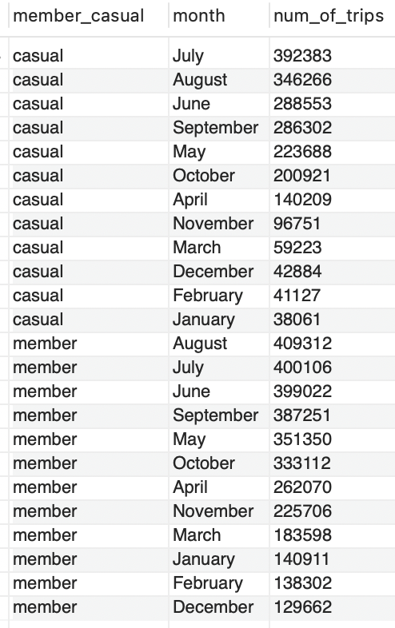  
  Both annual and casual members show the same seasonal tendency (most trips are done in summer, least - in winter)
- Average trip length per month *(image can be zoomed by clicking on it)*  
  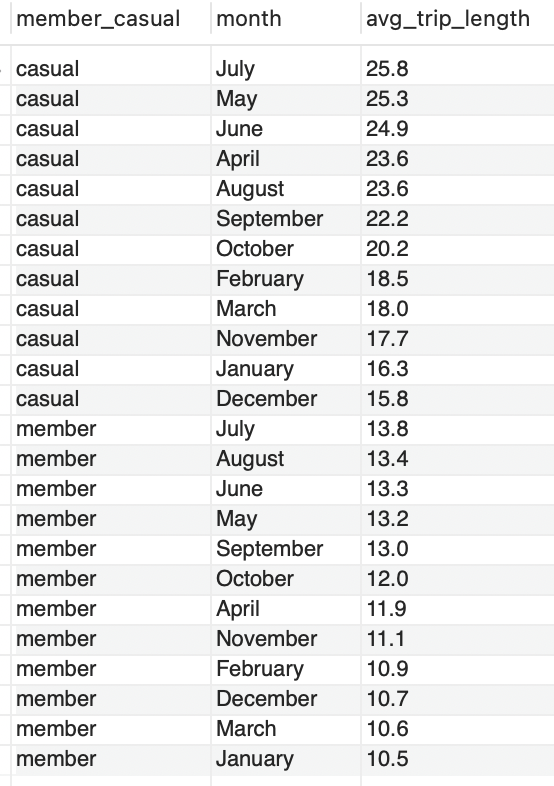  
  The average trip length have the same seasonal tendency for both annual and casual members: warmer months - longer trips, colder months - shorter trips.
    
  Now, lets compare the most popular pick-up station for two types of members:
- Top 5 most populair start stations for annual members  
  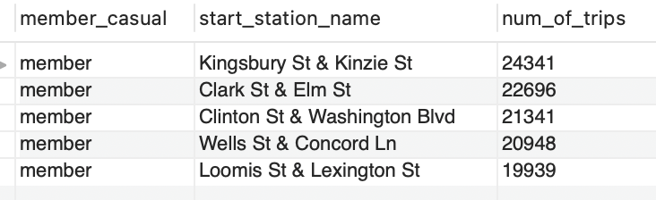  
- Top 5 most populair start stations for casual members  
  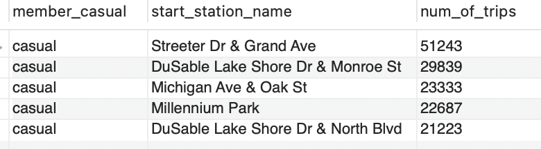  

### Share Data
Most of the time numbers are difficult to understand, that is why I used Tableau in order to create visualization.

### Conclussion
In this case study I had an opportunity to analyze historical bicycle trip data in order to identify trends. 
Understanding how casual riders behave differently from riders with paid memberships is important. 
This analysis will help executives to make decisions about marketing programs and strategies to convert casual riders to riders with annual memberships.
