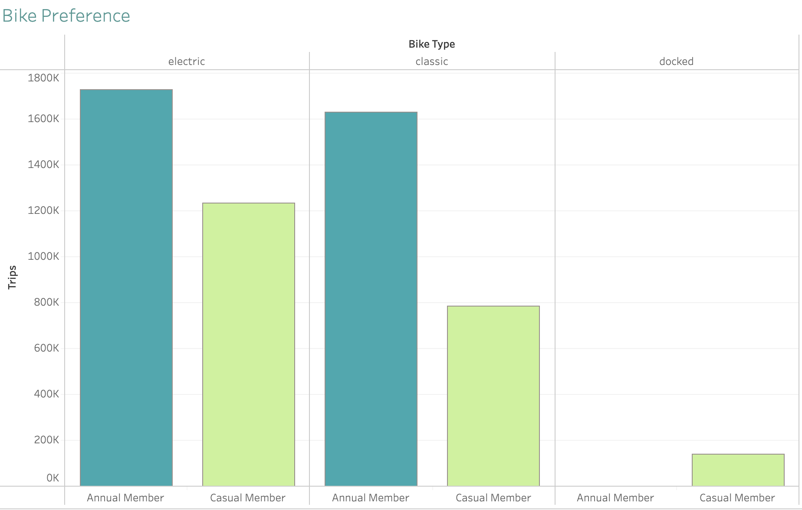

## Case Study: Cyclistic bike-share analysis   

### Course: Google Data Analytics Capstone: Complete a Case Study at [Coursera](https://www.coursera.org/learn/google-data-analytics-capstone)

Quick Links:  
[Scenario](./README.md#scenario)  
[Business Question](./README.md#business-question)  
[Prepare Data](./README.md#prepate-data)  
[Process Data](./README.md#process-data)  
[Analyze Data](./README.md#analyze-data)  
[Share Data](./README.md#share-data)  
[Summary](./README.md#summary)

### Scenario
In this case study I am a junior data analyst working in the marketing analyst team at Cyclistic, a bike-share company in Chicago. The director
of marketing believes the company’s future success depends on maximizing the number of annual memberships. Therefore,
the team wants to understand how casual riders and annual members use Cyclistic bikes differently. From these insights,
the team will design a new marketing strategy to convert casual riders into annual members.  

  

### Business Question
As a jr. data analyst I was assigned you to answer the question:  
**How do annual members and casual riders use Cyclistic bikes differently?**

### Prepate Data  
[SQL Code - Prepare](./01_prepare_data.sql)      
I downloaden 12 most recent datasets (july 2022 - june 2023) from a Cyclistic’s historical trip data (provided by the course in .csv format).  
Confirmed that all files have the same structure.
In MySQL Workbench I created a database *cyclistic*, a table *trips* and
loaded 12 .csv files in order to combine all datasets into one file.  

Combined dataset has 13 columns:  
*ride_id, rideable_type, started_at, ended_at, start_station_name, start_station_id, end_station_name, end_station_id, start_lat, start_lng, end_lat, end_lng, member_casual*  
and *5 779 444* rows in total

### Process Data 
[SQL Code - Process](./02_process_data.sql)  
In this step I continued to explore the data:   
- Checked if there are any duplicates  
  I used two different ways to check duplicates and both of them showed there are no duplicates in the data (details in the SQL Process Code section)   
- Counted total rows, total rows with missing values, their difference and percentage
  |total_rows|total_missing|difference|percent|
  |:-:|:-:|:-:|:-:|
  |5779444|1370355|4409089|23.7|

  More than 23% of rows have missing values, lets find out which columns have missing values  
- Counted total missing values per column
|ride_id|rideable_type|started_at|ended_at|start_station_name|start_station_id|end_station_name|end_station_id|start_lat|start_lng|end_lat|end_lat|member_casual|
  |:-:|:-:|:-:|:-:|:-:|:-:|:-:|:-:|:-:|:-:|:-:|:-:|:-:|
  |0|0|0|0|857860|857992|915655|915796|0|0|5795|5795|0|

  6 columns have missing values: *start_station_name, start_station_id, end_station_name, end_station_id, end_lat, end_lat*.  
  All of them are related to the location, that won't have any impact on my analysis.  
- Checked if all dates are in the correct range of time  
  There is no data outside the selected range of time.  
- Counted how many trips are shorter than 1 minute  
  There are *149 372* trips shorter than 1 minute  
- ... and longer than 48 hours (weekend)  
  *1 194* trips are longer than 48 hours  
  
Next, I created a view *vw_trips* with extra columns: *ride_length_min*, *day_of_week* and *month*.  
Also I excluded from this view all trips with duration less than 1 minute or more than 48 hours, but 
I left the rows with missing values in 'location columns' in this view, because I still can use this data for location-not-related analysis.  
So created View represents clean data, that is ready for further analysis.

### Analyze Data
[SQL Code - Analyze](./03_analyze_data.sql)  
In my analysis I have got next results:
- Count how many trips were made by annual and casual members in one year period
  |membership|total_rides|
  |-|:-:|
  |member|3360402|
  |casual|2156368|  

  As we can see most customers are annual members, but still there is a lot of casual members.
- Customers bike type preferences: number of trips per membership and bike type
  |type|member|casual|
  |-|:-:|:-:|
  |classic_bike|1631779|783931|
  |electric_bike|1728623|1234166|
  |docked_bike|0|138271|

  
  Annual members ride classic or electric bikes, while casual members are the only riders of docked bikes,
  also they prefer electic bikes to classic.  
- Average trip duration in minutes
  |membership|duration|
  |-|:-:|
  |member|12.5|
  |casual|23.1|
  
  The average trip duration of casual members is twice as long as annual members.  
- Average trip duration per type of bike in minutes 
  |rideable_type|member|casual|
  |-|:-:|:-:|
  |classic_bike|13.7|28.8|
  |electric_bike|11.3|15.3|
  |docked_bike|NULL|60.1|
  
  The longest average trip duration has docked type of bike, followed by classic bike. Both are ridden by casual members. 
- Number of trips depending on weekday
  |day|member|casual|
  |-|:-:|:-:|
  |Monday|453743|243206|
  |Tuesday|521872|246990|
  |Wednesday|544147|266347|
  |Thursday|537112|286759|
  |Friday|492559|333383|
  |Saturday|442280|442179|
  |Sunday|368689|337504|

  
  Casual members prefer to take a ride in weekends, while annual members - on weekdays  
- Average trip duration per day of the week in minutes
  
  |day|member|casual|
  |-|:-:|:-:|
  |Monday|11.8|22.7|
  |Tuesday|11.9|20.4|
  |Wednesday|11.9|19.9|
  |Thursday|12.0|20.2|
  |Friday|12.4|22.4|
  |Saturday|14.1|26.3|
  |Sunday|13.8|26.5|

  Both annual and casual members show the tendency to have longer trips in weekends.  
- Number of trips per month
  |month|member|casual|
  |-|:-:|:-:|
  |January|140911|38061|
  |February|138302|41127|
  |March|183598|59223|
  |April|262070|140209|
  |May|351350|223688|
  |June|399022|288553|
  |July|400106|392383|
  |August|409312|346266|
  |September|387251|286302|
  |October|333112|200921|
  |November|225706|96751|
  |December|129662|42884|
   
  Both annual and casual members show the same seasonal tendency (most trips are done in summer, least - in winter)
- Average trip duration per month
  |month|member|casual|
  |-|:-:|:-:|
  |January|10.5|16.3|
  |February|10.9|18.5|
  |March|10.6|18.0|
  |April|11.9|23.6|
  |May|13.2|25.3|
  |June|13.3|24.9|
  |July|13.8|25.8|
  |August|13.4|23.6|
  |September|13.0|22.2|
  |October|12.0|20.2|
  |November|11.1|17.7|
  |December|10.7|15.8|
 
  The average trip duration have the same seasonal tendency for both annual and casual members: warmer months - longer trips, colder months - shorter trips.
    
  Now, lets compare the most popular pick-up station for two types of members:
- Top 5 most populair start stations for annual members
  |station|trips|
  |-|:-:|
  |"Kingsbury St & Kinzie St"|24341|
  |"Clark St & Elm St"|22696|
  |"Clinton St & Washington Blvd"|21341|
  |"Wells St & Concord Ln"|20948|
  |"Loomis St & Lexington St"|19939|

- Top 5 most populair start stations for casual members
  |station|trips|
  |-|:-:|
  |"Streeter Dr & Grand Ave"|51243|
  |"DuSable Lake Shore Dr & Monroe St"|29839|
  |"Michigan Ave & Oak St"|23333|
  |"Millennium Park"|22687|
  |"DuSable Lake Shore Dr & North Blvd"|21223|

### Share Data
Most of the time numbers are difficult to understand, that is why I have used Tableau to create visualizations.  
Visualizations on my Tableau Public profile [cyclistic by Iryna M.](https://public.tableau.com/app/profile/iryna.m./viz/cyclistic_16921134477300/Dashboard1)  

Let's visualize amount of trips made by each type of member  
  
There are  approx. one trird more annual members, than casual  

Next, lets take a look at the difference in trips duration between 2 types of members  
  
Casual members ride bikes twice longer than annual members: 23.1 minutes vs. 12.5 minutes.

How does bike type preference differ?  
  
Annual members ride classic or electric bikes, while casual members prefer electic bikes to classic. Also they are the only riders of docked bikes.  

How does trip duration differ per type of bike and membership?  
   
The longest average trip duration has docked type of bike, followed by classic bike. Both are ridden by casual members.   

What are weekday preferences?  
   
Casual members prefer to take a ride in weekends, while annual members - on weekdays   
 
How does trip duration differ per weekday?  
  
Both annual and casual members show the tendency to have longer trips in weekends.  

Is there a seasonal difference in using cyclistics bikes?  
  
Both annual and casual members show the same seasonal tendency (most trips are done in summer, least - in winter)  

How does trip duration differ per month?  
  
The average trip duration have the same seasonal tendency for both annual and casual members: warmer months - longer trips, colder months - shorter trips.  

### Summary  
As a result of the analysis next differences were found:
|Difference|Casual Member|Annual Member|
|-|-|-|
|Bike Preferences|electric bike rather than classic, sometimes - docked |classic or electric, nerver docked|
|Avg Trip Duration (minutes)|electric - 15.3 , classic - 28.8 , docked - 60.1|electric - 11.3 , classic - 13.7|
|Day Preference|weekends|weekdays|

Also I have created summary dashboard with most important differences between memberships  
    
  
In this case study I had an opportunity to analyze historical bicycle trip data in order to identify trends. 
Understanding how casual riders behave differently from riders with paid memberships is important, it will help executives to make decisions about marketing programs and strategies to convert casual riders to riders with annual memberships.
